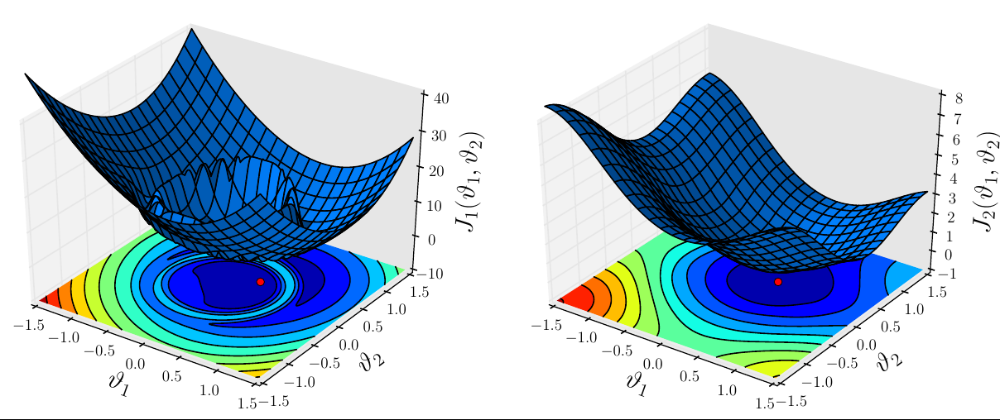

# numbio: Numerical Biomarkers Design Algorithm

### Welcome to our numbio project!

 

### What is this?

This the code (written in Python) used to compute numerical biomarkers.
Numerical biomarkers are features designed to easily solve inverse and
classification problems.
For more details about the method and its applications, we refer you to our poster
(poster.pdf) and to our publication (coming soon).

### Requirements

This code works with both versions 2.7 and 3.4 of Python and does not require
any external package.
For the production of figures (optional), both versions 1.1.1 and 1.5.1 of matplotlib work fine.

### Try the demo!

There is no better way to understand the method than to try it yourself!
Follow the instructions to compute numerical biomarkers for a very simple test
case.

> python numericalBiomarkers.py demo 0

The command to be executed in general is the following:

> python numericalBiomarkers.py your_case_name plotFigures

where plotFigures is 0 (no figure) or 1 (plot figures).
